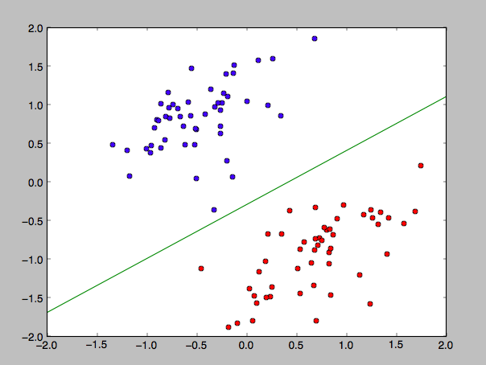
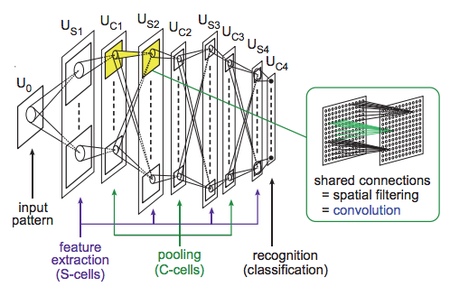

# 研究の歴史
## 多層ニューラルネットへの期待と失望
ニューラルネットワークはこれまでに2度のブームが訪れている    

1回目のブーム    
　1960年代〜1970年代    
　パーセプトロン(1層ニューラルネット)    

2回目のブーム   
　80年代半ばから90年代前半前半    
　誤差逆伝搬の誕生(多層ニューラルネット)

### パーセプトロンの欠点    
　ノイズに弱い    
　収束が遅く、学習効率が悪い(誤差逆伝搬でいう損失関数の微分を効率的に使ったパラメータ更新が行えない)
　n次元の入力に対して重み付けを行った結果がある値より大きいかどうかで2つのクラスに分類する
　y=WtX　(Wt：学習済みの重み、 X:入力、 y:2つのクラスを分類する境界)
　線形分離可能な問題にしかできない(多層化できれば解決できる)    
　多層化できない(中間層を出力することができない)
　

### 誤差逆伝搬(多層ニューラルネット)の欠点
　入力にノイズがあったら過学習は発生する    
　2層程度であれば期待通りだが、それより増やしていくと勾配が急速にに小さくなったり大きくなったりする勾配消失問題が発生する
　※ニューラルネットの層を増やす動きがあるが、これは中間層を用意することで柔軟なネットワークを構築でき学習精度を高めることができるからである、誤差逆伝搬により多層化は行えるが層が増えると勾配が消失しあまり精度が上がらなくなるという問題がある
　※この頃はニューラルネットの層数やユニット数(中間層の主力)の設定に対しての理論がなかった

### 畳み込みニューラルネットの誕生
1980年代後半画像を対象としていた畳み込みニューラルネットについてはこの時点で5層からなる多層ネットワークの学習に成功していた    
※前の層の畳み込みの出力を粗くリサンプリングするようなイメージとなっており、これにより画像の多少のずれによる見え方の違いを吸収することが可能となり勾配消失問題が発生しなかった    
1980年代半ばからのブームの多層ニューラルネットワークでは角層の出力全てを次の層に入力していた(全結合)
多層ニューラルネットワーク自体の研究低下とともに畳み込みニューラルネットの関心も小さくなっていった    

## 多層ネットワークの事前学習
1990年代〜2000年代前半(ニューラルネットの関心が低い時期)    
ディープビリーフネットワーク(DBN)の研究    
　一つの層を貪欲アルゴリズムで訓練できることでブレークスルーとなった    
制約ボルツマンマシン(RBM)の誕生

その後、自己符号化の登場

1990年代〜2000年代前半では事前学習によりノイズ除去などで良い入力を得られるようにする研究が行われた

## 特徴量の学習
画像や音声などの自然界のデータなど同じものでもちょっとの違いでデータに差が出るものをネットワークの多層構造に取り込むために、どのように特徴量を抽出するか   
　例えば猫の画像でも明るさが違ったり、向きが違ったりするだけでデータとして差が出る    
　音声の場合は白色ノイズなど、扱うデータの種類によりノイズの種類も様々    
　正規化することでそれらの違いを吸収した特徴量の情報が欲しい    

画像や音声については事前学習ではなく事前処理による特徴量抽出で良い入力を得られるようにしていた

## 深層学習の隆盛
音声認識、画像認識のベンチマークで多層ニューラルネットワークの有効性が認められるようになり深層学習の有効性が広く認知されるようになった    
　一重に深層学習といっても扱う対象によって学習方法が異なる    
　・音声認識の場合は層間ユニット全結合で事前学習が一般的に行われる    
　・画像認識では畳込みニューラルネットが主流で事前学習は不要    
　・自然言語処理、音声認識の特定のタスクでは再帰型ニューラルネット    

それぞれ学習方法が違う多層ニューラルネットワークで性能を把握できるようになった    
　→共通の理由は計算機の計算能力の飛躍的な功により扱えるデータが増えた

[GPU Technology Conference](http://www.gputechconf.com/)とかみるとGPUの発達が深層学習に与える影響が大きそうに感じる    

計算機の処理能力向上によりニューラルネットワークの多層化をしたら思わぬ結果が出た
